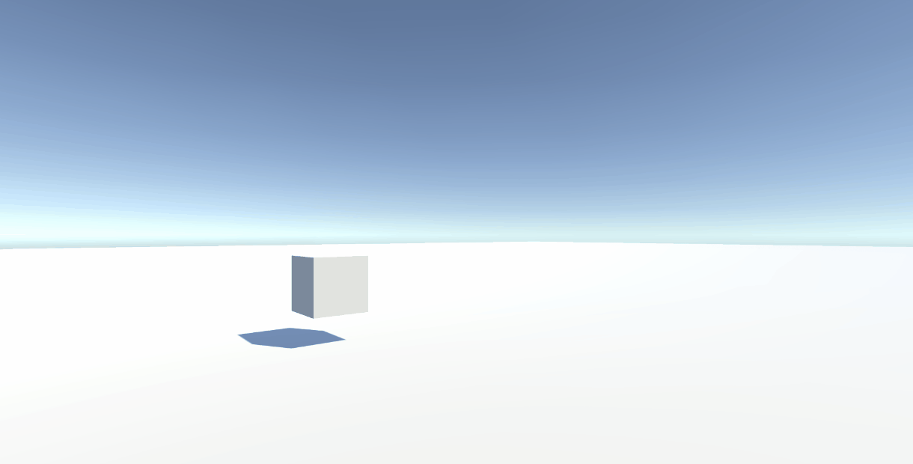
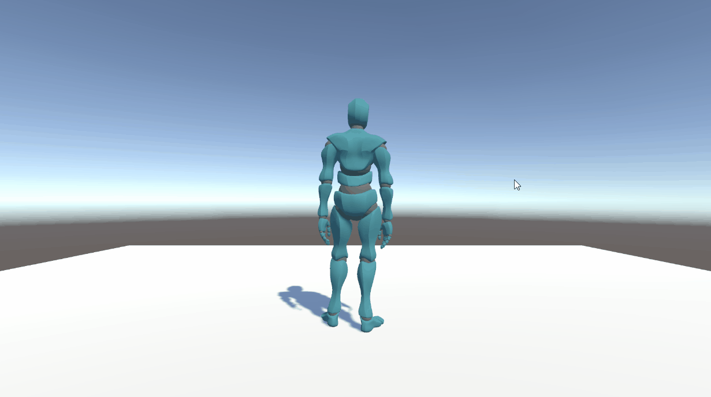
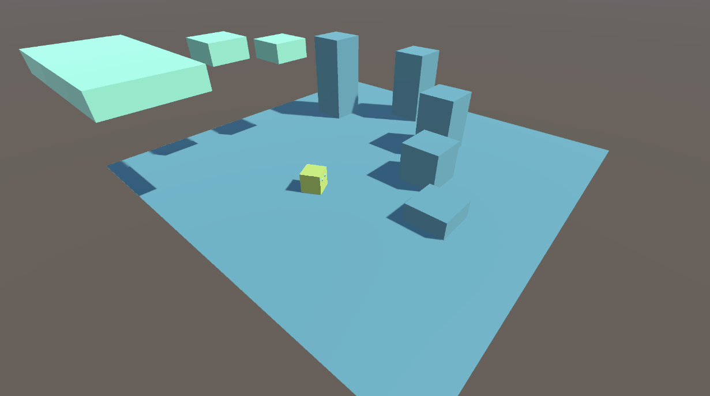

# Prog Tutorials

---------------------------

## Tutorial 0

Cube getting launched up "\(￣︶￣*\))

## Tutorial 1

(* ￣︿￣)

## Tutorial 2

walking and walkingR o(*￣▽￣*)ブ

## Tutorial 3

Tutorial 3 - Completed ヾ(￣▽￣)

